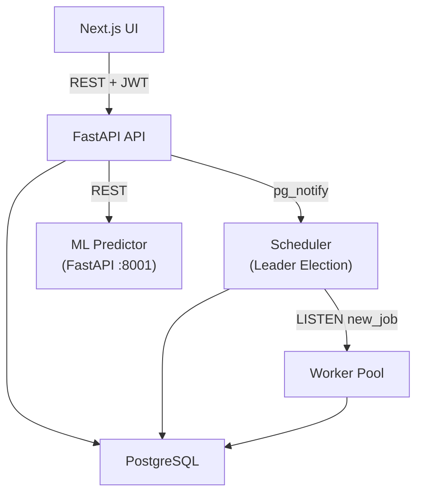

<!-- # SmartQueue — AI-Powered Adaptive Task Scheduler -->

<div align="center">

## RavenMQ - AI-Powered Adaptive Task Scheduler

  

  <p>
    
    
    
    
    
    
    
    
  </p>

> Final Year Project | B.Tech Computer Science & Engineering
> Akshat Chauhan | Kalinga Institute of Industrial Technology (KIIT)

</div>

<!-- > Final Year Project | B.Tech Computer Science & Engineering
> Akshat Chauhan | Kalinga Institute of Industrial Technology (KIIT) -->

<!-- <div align="center">
  
</div> -->

## Table of Contents

- [Overview](#overview)
- [Problem Statement](#problem-statement)
- [Key Features](#key-features)
- [Tech Stack](#tech-stack)
- [System Architecture](#system-architecture)
- [Project Structure](#project-structure)
- [Getting Started](#getting-started)
  - [Docker Compose](#option-1--docker-compose-recommended)
  - [Kubernetes](#option-2--kubernetes)
  - [Local Dev](#option-3--local-dev)
- [Authentication & Authorization](#authentication--authorization)
- [API Reference](#api-reference)
- [The ML Model](#the-ml-model)
- [Database Schema](#database-schema)
- [Distributed Systems Design](#distributed-systems-design)
- [CI/CD](#cicd)
- [What Makes This Novel](#what-makes-this-novel)
- [License](#license)
- [Author](#author)

## Overview

SmartQueue is a distributed task scheduling platform that uses a hand-built LSTM neural network (NumPy, no frameworks) to learn from historical job execution patterns and dynamically assign priority scores to incoming tasks. Unlike conventional schedulers that use static rules, SmartQueue gets smarter over time — predicting how long a job will take and reordering the queue accordingly.

Multi-tenant by design: users belong to organizations, see each other's jobs within their org, and are isolated from other orgs. Three role tiers — `admin`, `org_admin`, `user` — with JWT-based auth and rate limiting throughout.

---

## Problem Statement

Modern backend systems run heterogeneous workloads — data pipelines, ML training jobs, HTTP callbacks, shell scripts — all competing for the same worker resources. Static priority scheduling causes two core problems:

1. **Priority inversion** — long-running low-priority jobs block short high-priority ones
2. **No learning** — the scheduler never improves from past execution data

SmartQueue solves both by training an LSTM on execution history and using predicted runtime to compute dynamic priority scores in real time.

---

## Key Features

- **AI-powered priority scheduling** — LSTM trained from scratch in NumPy predicts job runtime and assigns dynamic priority scores
- **Multi-tenant org model** — users belong to organizations, org-scoped job visibility, role-based access control
- **JWT authentication** — HMAC-SHA256 tokens, no third-party auth libraries, stateless across API replicas
- **Distributed microservices** — 6 independent services communicating over HTTP and a shared PostgreSQL database
- **Analytics dashboard** — throughput charts, predicted vs actual runtime, prediction accuracy scatter plot
- **Fault tolerance** — `FOR UPDATE SKIP LOCKED` for safe concurrent worker access, automatic retry logic
- **Auto-scaling** — Kubernetes Horizontal Pod Autoscaler scales workers 1→5 pods based on CPU
- **Security hardening** — rate limiting (`slowapi`), input validation (Pydantic), CORS lockdown
- **CI/CD** — GitHub Actions builds and pushes Docker images to Docker Hub on every push to `main`
- **Fully containerised** — every service in Docker, orchestrated with Kubernetes
- **Leader election** — PostgreSQL advisory locks elect a scheduler leader; standby instances take over within 2 seconds of leader failure, no ZooKeeper or etcd required
- **Exactly-once execution** — lease-based job claiming with visibility timeouts; watchdog reclaims stuck jobs from dead workers automatically
- **Event-driven dispatch** — PostgreSQL LISTEN/NOTIFY replaces polling; job pickup latency reduced from 2s to sub-100ms
- **Observability** — Prometheus metrics (queue depth, worker count, prediction MAPE) exposed at `/metrics`

---

## Tech Stack

| Layer            | Technology                             |
| ---------------- | -------------------------------------- |
| Frontend         | Next.js 15, React, TypeScript          |
| API              | FastAPI (Python 3.12)                  |
| Scheduler        | Node.js, TypeScript, min-heap          |
| Worker           | Python 3.12                            |
| ML Predictor     | Python 3.12, NumPy (LSTM from scratch) |
| Database         | PostgreSQL 16                          |
| Auth             | JWT — HMAC-SHA256, stdlib only         |
| Containerisation | Docker, Docker Compose                 |
| Orchestration    | Kubernetes, kubectl, HPA               |
| CI/CD            | GitHub Actions, Docker Hub             |
| Rate Limiting    | slowapi                                |
| Leader Election  | PostgreSQL Advisory Locks              |

---

## System Architecture



---

## Project Structure

```
smartqueue/
├── services/
│   ├── api/              # FastAPI — auth, jobs, orgs, analytics
│   ├── scheduler/        # TypeScript — min-heap priority queue
│   ├── worker/           # Python — job execution, retry logic
│   └── predictor/        # NumPy LSTM — training and inference
├── frontend/             # Next.js — queue, analytics, profile
│   └── app/
│       ├── components/   # Shared Topbar with profile dropdown
│       ├── analytics/    # Analytics dashboard page
│       └── login/        # Login / register page
├── db/
│   └── migrations/       # 001_init → 006_leader_election
├── docker/
│   └── docker-compose.yml
├── k8s/                  # Kubernetes manifests + HPA
│   ├── namespace.yaml
│   ├── secrets.yaml
│   ├── postgres/
│   ├── api/
│   ├── worker/           # includes hpa.yaml
│   ├── scheduler/
│   ├── predictor/
│   └── frontend/
└── .github/
    └── workflows/
        └── ci.yml        # Build + push to Docker Hub, lint, typecheck
```

---

## Getting Started

### Option 1 — Docker Compose (recommended)

```bash
git clone https://github.com/AkZcH/SmartQueue.git
cd SmartQueue/docker
docker compose up -d
```

All 6 services start automatically in the correct order. Open:

- **http://localhost:3000** — dashboard
- **http://localhost:8000/docs** — API explorer
- **http://localhost:8001/docs** — ML predictor

### Option 2 — Kubernetes

```bash
kubectl apply -f k8s/namespace.yaml
kubectl apply -f k8s/secrets.yaml
kubectl apply -f k8s/postgres/
kubectl apply -f k8s/predictor/
kubectl apply -f k8s/api/
kubectl apply -f k8s/worker/
kubectl apply -f k8s/scheduler/
kubectl apply -f k8s/frontend/
kubectl get pods -n smartqueue
```

Frontend at **http://localhost:30001**, API at **http://localhost:30000**.

### Option 3 — Local dev

```bash
# Terminal 1 — Database
cd docker && docker compose up -d db

# Terminal 2 — API
cd services/api && uvicorn app.main:app --reload --port 8000

# Terminal 3 — ML Predictor
cd services/predictor && uvicorn app:app --reload --port 8001

# Terminal 4 — Scheduler
cd services/scheduler && npx ts-node src/index.ts

# Terminal 5 — Worker
cd services/worker && python worker.py

# Terminal 6 — Frontend
cd frontend && npm run dev
```

---

## Authentication & Authorization

All job endpoints require a JWT token. Register and login:

```bash
# Register
curl -X POST http://localhost:8000/auth/register \
  -H "Content-Type: application/json" \
  -d '{"username": "alice", "password": "secret123"}'

# Login
curl -X POST http://localhost:8000/auth/login \
  -H "Content-Type: application/json" \
  -d '{"username": "alice", "password": "secret123"}'
```

Use the returned token in subsequent requests:

```bash
curl http://localhost:8000/jobs/ \
  -H "Authorization: Bearer <token>"
```

### Roles

| Role        | Permissions                               |
| ----------- | ----------------------------------------- |
| `admin`     | See all jobs across all orgs              |
| `org_admin` | See all jobs in their org, invite members |
| `user`      | See all jobs in their org, submit jobs    |

### Organizations

```bash
# Create an org (you become org_admin)
curl -X POST http://localhost:8000/orgs/ \
  -H "Authorization: Bearer <token>" \
  -H "Content-Type: application/json" \
  -d '{"name": "my-company"}'

# Invite a user
curl -X POST http://localhost:8000/orgs/<org_id>/invite \
  -H "Authorization: Bearer <token>" \
  -H "Content-Type: application/json" \
  -d '{"username": "bob"}'
```

---

## API Reference

### Auth

| Method | Endpoint         | Description             |
| ------ | ---------------- | ----------------------- |
| POST   | `/auth/register` | Register (5/min limit)  |
| POST   | `/auth/login`    | Login (10/min limit)    |
| GET    | `/auth/users`    | List users (admin only) |

### Jobs

| Method | Endpoint                 | Description                      |
| ------ | ------------------------ | -------------------------------- |
| POST   | `/jobs/`                 | Submit a job                     |
| GET    | `/jobs/`                 | List jobs (org-scoped)           |
| GET    | `/jobs/{id}`             | Get a specific job               |
| GET    | `/jobs/workers`          | Live worker pool status          |
| GET    | `/jobs/scheduler/leader` | Current leader (via jobs router) |

### Organizations

| Method | Endpoint            | Description        |
| ------ | ------------------- | ------------------ |
| POST   | `/orgs/`            | Create org         |
| POST   | `/orgs/{id}/invite` | Invite user to org |
| GET    | `/orgs/me`          | Get your org info  |
| GET    | `/orgs/me/members`  | List org members   |

### Analytics

| Method | Endpoint                         | Description                   |
| ------ | -------------------------------- | ----------------------------- |
| GET    | `/analytics/summary`             | Job counts, success rate      |
| GET    | `/analytics/throughput`          | Jobs per hour (last 24h)      |
| GET    | `/analytics/prediction-accuracy` | Actual vs predicted           |
| GET    | `/analytics/queue-depth`         | Queue depth over time         |
| GET    | `/analytics/scheduler-leader`    | Current scheduler leader info |
| <!--   | GET -->                          |

<!-- /metrics                      Prometheus metrics endpoint -->

---

## The ML Model

The priority prediction model is a 2-layer LSTM implemented entirely in NumPy — no PyTorch, no TensorFlow. It takes the last 3 job types as input sequence and outputs a context adjustment factor applied to base runtimes:

```
Base runtimes: http=400ms, shell=1500ms, etl=3000ms, ml=12000ms
Context factor: LSTM output mapped to [0.7, 1.3] (±30% adjustment)
Predicted runtime: base_ms × context_factor
Priority score: 1.0 / (1.0 + predicted_runtime_ms / 3000.0)
```

Shorter predicted runtime → higher priority score → job moves up the queue.

---

## Database Schema

### `jobs`

| Column      | Type        | Description                      |
| ----------- | ----------- | -------------------------------- |
| id          | UUID        | Primary key                      |
| name        | TEXT        | Job name                         |
| type        | TEXT        | etl / ml / http / shell          |
| payload     | JSONB       | Job parameters                   |
| status      | TEXT        | queued / running / done / failed |
| priority    | FLOAT       | ML-assigned priority score (0–1) |
| user_id     | UUID        | Submitting user                  |
| org_id      | UUID        | Submitting user's org            |
| created_at  | TIMESTAMPTZ | Submission time                  |
| started_at  | TIMESTAMPTZ | Execution start                  |
| finished_at | TIMESTAMPTZ | Execution end                    |
| retry_count | INT         | Number of retries                |
| error_msg   | TEXT        | Error message if failed          |

### `execution_logs`

| Column               | Type        | Description           |
| -------------------- | ----------- | --------------------- |
| id                   | UUID        | Primary key           |
| job_id               | UUID        | Foreign key → jobs    |
| runtime_ms           | INT         | Actual execution time |
| predicted_runtime_ms | INT         | ML predicted time     |
| worker_id            | TEXT        | Which worker ran it   |
| logged_at            | TIMESTAMPTZ | Log timestamp         |

### `users`

| Column        | Type        | Description                 |
| ------------- | ----------- | --------------------------- |
| id            | UUID        | Primary key                 |
| username      | TEXT        | Unique username             |
| password_hash | TEXT        | HMAC-SHA256 hash            |
| role          | TEXT        | admin / org_admin / user    |
| org_id        | UUID        | Foreign key → organizations |
| created_at    | TIMESTAMPTZ | Registration time           |

### `organizations`

| Column     | Type        | Description     |
| ---------- | ----------- | --------------- |
| id         | UUID        | Primary key     |
| name       | TEXT        | Unique org name |
| created_at | TIMESTAMPTZ | Creation time   |

### `worker_registry`

| Column           | Type          | Description                  |
| ---------------- | ------------- | ---------------------------- |
| `worker_id`      | `TEXT`        | Primary key — hostname-based |
| `hostname`       | `TEXT`        | Container hostname           |
| `status`         | `TEXT`        | `active` / `offline`         |
| `last_seen`      | `TIMESTAMPTZ` | Last heartbeat               |
| `jobs_processed` | `INT`         | Lifetime job count           |
| `started_at`     | `TIMESTAMPTZ` | Registration time            |

### `scheduler_leader`

| Column       | Type          | Description                      |
| ------------ | ------------- | -------------------------------- |
| `id`         | `INT`         | Always `1` — single row          |
| `worker_id`  | `TEXT`        | Current leader instance          |
| `elected_at` | `TIMESTAMPTZ` | When this instance became leader |
| `last_seen`  | `TIMESTAMPTZ` | Last heartbeat from leader       |

---

## Distributed Systems Design

### Leader Election

The scheduler runs as multiple instances. On startup each instance attempts `pg_try_advisory_lock(12345)` — a PostgreSQL advisory lock. Only one instance acquires it and becomes leader. When the leader dies, PostgreSQL automatically releases the lock and a standby wins it within 2 seconds. No ZooKeeper, no etcd, no Redis required.

### Exactly-Once Execution

Job claiming uses `FOR UPDATE SKIP LOCKED` — PostgreSQL's primitive for contention-free concurrent access. When a worker claims a job it receives a lease (`lease_expires_at = now() + 30s`). The worker renews the lease every 10 seconds. A watchdog process scans for expired leases and requeues stuck jobs automatically.

### Event-Driven Dispatch

When a job is submitted the API fires `pg_notify('new_job', job_id)`. The scheduler leader holds a dedicated LISTEN connection and rebuilds the priority heap immediately on notification — no polling required. Job pickup latency dropped from 2 seconds to sub-100 milliseconds.

### Fault Tolerance

- Worker crashes → lease expires → watchdog requeues the job
- Scheduler crashes → advisory lock released → standby elected within 2s
- API crashes → stateless JWT means any replica can serve any request
- Predictor down → worker falls back to default priority (0.5)

### Concurrency Model

```
Job submitted → API → pg_notify → Scheduler (LISTEN) → heap rebuild
                   → multiple workers competing via FOR UPDATE SKIP LOCKED
                   → exactly one worker claims the job
                   → lease renewed every 10s until completion
```

## CI/CD

Every push to `main` triggers a GitHub Actions workflow that:

1. Runs Python import checks and TypeScript typecheck
2. Builds Docker images for all 5 services
3. Pushes tagged images to Docker Hub (`de4dl0ck/smartqueue-*:latest` and `:<git-sha>`)

Images: `de4dl0ck/smartqueue-api`, `de4dl0ck/smartqueue-worker`, `de4dl0ck/smartqueue-predictor`, `de4dl0ck/smartqueue-scheduler`, `de4dl0ck/smartqueue-frontend`

---

## What Makes This Novel

Conventional schedulers (Celery, Airflow, BullMQ) assign priority statically. SmartQueue differs in five ways:

1. **Learns runtime patterns** from execution history using a hand-built LSTM — no ML framework dependency
2. **Genuinely distributed** — leader election via PostgreSQL advisory locks, automatic failover, lease-based exactly-once execution semantics
3. **Event-driven** — PostgreSQL LISTEN/NOTIFY eliminates polling; jobs are dispatched within 100ms of submission
4. **Org-scoped multi-tenancy** — team-aware job visibility with three-tier RBAC
5. **Adaptive infrastructure** — Kubernetes HPA scales workers automatically; Prometheus exposes real-time queue and worker metrics

---

## License

This project is licensed under the MIT License — see the [LICENSE](./LICENSE) file for details.

## Author

**Akshat Chauhan**
B.Tech Computer Science & Engineering
Kalinga Institute of Industrial Technology (KIIT), Bhubaneswar

GitHub: [AkZcH](https://github.com/AkZcH)

---

_Built from scratch — every layer, every algorithm, every line of infrastructure._
